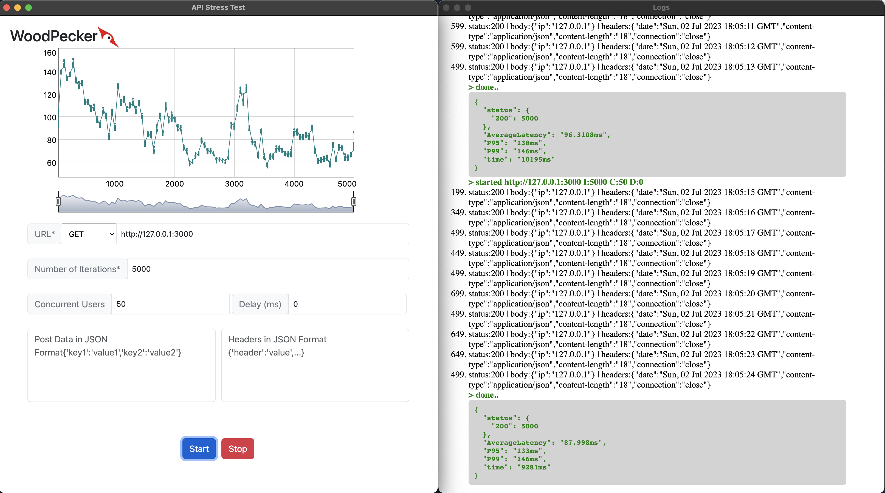

# WoodPecker 
API Load Test tool written in Javascript (Electron JS).



## Installation
Get the latest binary from [releases](https://github.com/uvish/woodpecker/releases/tag/1.0.0).

### Running from source
Clone the repository

```shell
git clone https://github.com/uvish/woodpecker.git
cd woodpecker
npm start
```
### Building from source
Clone the repository and run make included in electron forge template

```js
npm run make
```